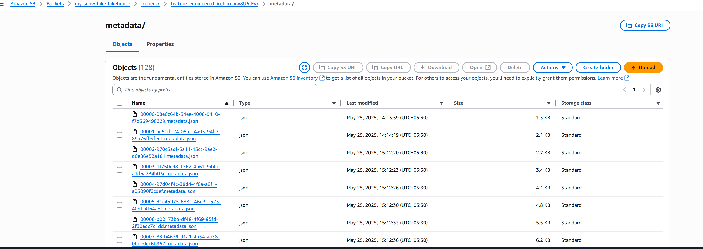
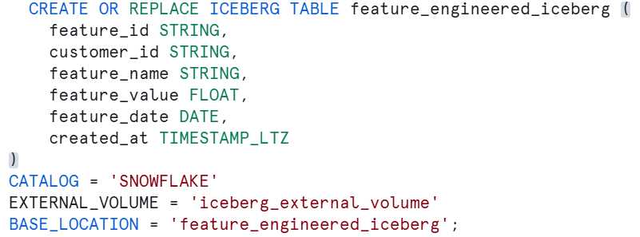
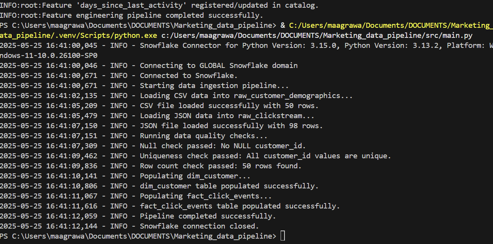
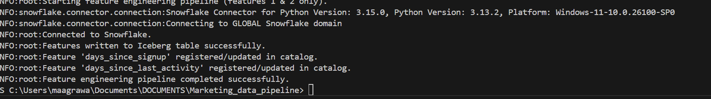

# Marketing Data Pipeline

This project implements a data pipeline to process and load marketing data from AWS S3 into Snowflake. It includes ingestion of CSV and JSON data, data quality (DQ) checks, idempotent loading, logging, and basic performance tuning using Snowflake best practices.

---

## 📁 Project Structure

```
Marketing_data_pipeline/
├── data/                         # Sample input files (CSV, JSON)
├── docs/                         # Documentation (architecture, data model)
│   ├── architecture_overview.md
│   ├── data_models.md
|   ├── data_flow_diagram.md
│   ├── Scalability_plan.md
│   └── feature_lineage.md
├── logs/                         # Log outputs
│   └── ingestion.log
├── src/                          
│   ├── dq_checks.py              # Data quality checks
│   ├── data_ingestion.py         # Ingestion logic
│   ├── utils.py                  # Helper functions (Snowflake connection, logger)
│   ├── main.py                   # Script to orchestrate the pipeline
│   ├── feature_engineering.py    # Conceptual feature testing
│   └── transformations.py        # data transformations
├── .env                          # Snowflake credentials (not committed)
├── README.md
```

---

## 📊 Overview

This pipeline is designed to load marketing engagement data — customer demographics and clickstream events — from S3 into Snowflake. The processed data can be used in dashboards and ML models.

---

## 🚀 Key Features

- Loads structured (CSV) and semi-structured (JSON) data
- Performs data quality checks to validate the integrity of incoming data
- Ensures idempotency by truncating target tables before loading
- Logs events both locally and optionally to Snowflake
- Adds clustering for basic performance tuning

---

## 📥 Input Datasets

- **CSV**: Customer demographics (`customer_id`, `first_name`, `email`, `signup_date`)
- **JSON**: Clickstream events (`event_type`, `page_url`, `duration_ms`)

Both datasets are stored in an S3 bucket and read via Snowflake external stages.

---

## 🛠 How to Run the Pipeline

1. **Clone the repository**
   ```bash
   git clone https://github.com/mankuagrawal09srm/MARKETING_DATA_PIPELINE.git
   cd Marketing_data_pipeline
   ```

2. **(Optional) Create and activate a virtual environment**
   ```bash
   python -m venv venv
   source venv/bin/activate    # On Windows: venv\Scripts\activate
   ```

3. **Install dependencies**
   ```bash
   pip install -r requirements.txt
   ```

4. **Set up environment variables**

   Create a `.env` file in the root directory with the following:
   ```ini
   SNOWFLAKE_ACCOUNT=your_account
   SNOWFLAKE_USER=your_username
   SNOWFLAKE_PASSWORD=your_password
   SNOWFLAKE_WAREHOUSE=your_warehouse
   SNOWFLAKE_DATABASE=your_database
   SNOWFLAKE_SCHEMA=your_schema
   ```

5. **Run the pipeline**
   ```bash
   python src/main.py
   ```

---

## ⚙️ Features Implemented

### Ingestion Logic
- Loads files via `COPY INTO` from S3 external stages
- Automatically creates tables if they don't exist
- Truncates before loading to ensure idempotency

### Data Quality Checks
- Null checks on critical columns
- Uniqueness validation on `customer_id`
- Row count validation

Logged into:
- Local log file
- Optionally: Snowflake table `dq_check_logs`

### Logging
- Local: `logs/ingestion.log`
- Optional Snowflake table: `PIPELINE_LOGS`

### Performance Optimization
- Adds clustering key on:
   ```sql
   ALTER TABLE raw_customer_demographics CLUSTER BY (customer_id);
   ```

---

## Feature Engineering Pipeline (Independent Module)

The `src/feature_engineering.py` script is implemented as a **standalone pipeline** that reads cleaned data from Snowflake, performs transformations to derive customer features, and stores the results in an Apache Iceberg table.

### 📥 Inputs
- `raw_customer_demographics` – Customer profile and sign-up data
- `raw_clickstream` – JSON-based web interaction logs

---

### ⚙️ Execution

Run the feature pipeline separately from the ingestion flow:

```bash
python src/feature_engineering.py
```

> Feature metadata is synced to `feature_catalog`  
> Feature records are stored in `feature_engineered_iceberg` (Iceberg table)
---

---

### 📊 Architecture Diagram
```
 [S3 CSV + JSON]
           |
       [Ingestion]
           |
     +------------+      
     | Snowflake  | <---+
     +------------+     |
           |            |
      [Transformations] |
           |            |
      [Cleaned Tables]  |
           |            |
       +----------------+
       |
 [Feature Pipeline]
       |
  +----------------------+
  |  feature_engineered  |
  |     + feature_catalog|
  +----------------------+
```
---

### Feature Catalog

A lightweight feature catalog is implemented as a Snowflake table named `feature_catalog`. It stores metadata for engineered features including:

- `feature_name`: Unique feature identifier
- `description`: Business logic or purpose
- `data_type`: Data type in Snowflake
- `source_table`: Raw or intermediate table used
- `transformation_summary`: Logic used to generate the feature
- `update_frequency`: How often the feature is refreshed
- `quality_metrics`: Basic data quality expectations

Features are inserted/updated via `src/feature_engineering.py`.

This helps track available features, their lineage, and quality expectations for downstream consumers like data scientists.

---

## 📚 Documentation

- [`docs/architecture_overview.md`](docs/architecture_overview.md): Design and flow of the pipeline
- [`docs/data_model.md`](docs/data_model.md): Schema and table descriptions

---

## 📸 Visuals and Screenshots

### Iceberg Table S3


### Iceberg Table View Snowflake


### Execution Logs


### Feature Engineering logs


---

### Testing Strategy

To ensure reliability and correctness of the pipeline components, the following testing approach has been adopted or can be planned:

## Unit Testing
Purpose: Validate individual functions/modules in isolation (e.g., parsing, transformations, data quality logic).

- Use pytest or unittest for writing test cases.
- Mock Snowflake connections and AWS S3 using unittest.mock or pytest-mock.
- Example tests:
  - Validate parsing logic in transformations.py
  - Test null/duplicate checks in dq_checks.py
  - Test utility functions in utils.py


## Integration Testing
Purpose: Test the interaction between modules end-to-end (e.g., ingestion + transformation + DQ checks).

- Use sample datasets stored in data/ to simulate real runs.
- Run src/main.py in a controlled environment with a test Snowflake schema.
- Validate:
  - Table creation and loading works as expected
  - Logs are written correctly
  - DQ check failures are handled properly

## Logging & Monitoring
- All scripts log execution status, row counts, and errors to both:
  - Local log files (logs/)
  - Snowflake logging tables (e.g., pipeline_logs, dq_check_logs)(implemented)

---

## 🧰 Technologies Used

- Python 3.9+
- Snowflake (data warehouse)
- AWS S3 (source data)
- `dotenv` for credential management
- Python’s standard `logging` module

---


## 🔮 Potential Future Enhancements

- Orchestration with Apache Airflow or AWS Step Functions
- Alerting for failed DQ checks (Slack, email)(sample function placed in dq_checks.py)
- Quarantine zone for failed records
- Schema validation and record freshness checks
- Unit testing using `pytest` and `unittest.mock`
